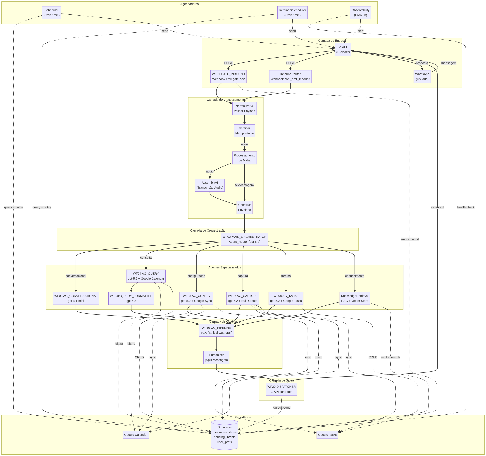
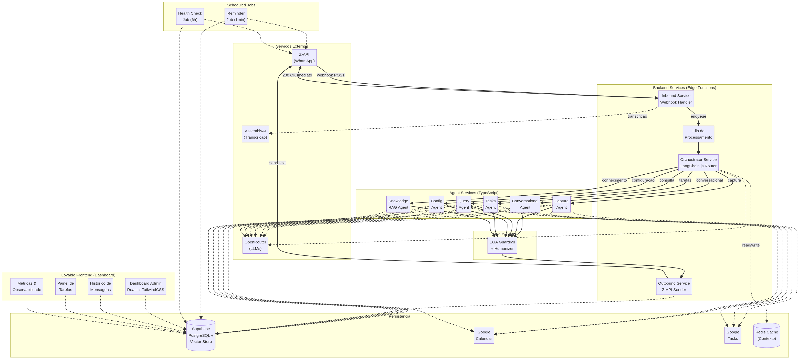

# Análise de Arquitetura e Plano de Migração (n8n para Lovable)

Este documento apresenta o diagnóstico técnico completo da infraestrutura da **AM (Assistente Executivo)** atualmente hospedada no n8n e o plano detalhado para sua migração e evolução utilizando a plataforma Lovable.

## 1. Diagnóstico da Arquitetura Atual

A arquitetura atual da AM foi construída de forma modular no n8n, totalizando 16 workflows interconectados que gerenciam desde a captura de mensagens via WhatsApp até a delegação de tarefas e sincronização de agendas. O sistema utiliza o padrão *Agentic Workflow*, onde um orquestrador central distribui intenções para agentes especializados.

### Componentes Principais e Funções

| Módulo / Workflow | Função Principal | Integrações Chave |
| :--- | :--- | :--- |
| **Gate Inbound** (WF01, InboundRouter) | Receber webhooks da Z-API, normalizar payloads, tratar idempotência e encaminhar para o orquestrador. Suporta processamento de áudio via AssemblyAI. | Z-API, Supabase, AssemblyAI |
| **Orquestrador** (WF02) | Analisar a intenção do usuário utilizando LLM (`gpt-5.2`) e rotear para o sub-agente apropriado (conversacional, captura, consulta, etc.). | OpenRouter |
| **Agentes de Captura e Tarefas** (WF06, WF08) | Extrair informações estruturadas (tarefas, lembretes, notas) da mensagem e criar itens no banco e nas ferramentas do Google. | Supabase, Google Calendar, Google Tasks |
| **Agentes de Consulta e Configuração** (WF04, WF04B, WF05) | Buscar informações na memória histórica, formatar respostas e gerenciar atualizações ou exclusões de itens. | Supabase, Google Calendar |
| **Recuperação de Conhecimento** (WF03_AGENTv1) | Agente RAG para busca semântica em documentos e bases de conhecimento. | Supabase (Vector Store) |
| **Pipeline de Qualidade e Saída** (WF10, WF20) | O *Ethical Guardrail Agent* revisa a resposta final, garante o tom adequado e despacha via Z-API. | OpenRouter, Z-API |
| **Agendadores e Observabilidade** (02_Scheduler, 05_Observability) | Rotinas cronometradas para envio de lembretes agendados e monitoramento da saúde do sistema. | Supabase, Z-API |

### Dependências Externas

O sistema depende fortemente das seguintes tecnologias, que **devem ser mantidas** na nova arquitetura:
*   **Supabase:** Banco de dados principal, memória de longo prazo e vector store. Tabelas principais: `items`, `messages`, `pending_intents`, `user_prefs`.
*   **Z-API:** Gateway de comunicação com o WhatsApp.
*   **Google Workspace:** Google Calendar (agenda) e Google Tasks (tarefas).
*   **OpenRouter:** Provedor de LLMs, utilizando majoritariamente a família GPT (`gpt-5.2`, `gpt-4.1-mini`, `gpt-5.1-codex`).
*   **AssemblyAI:** Serviço de transcrição de áudio.

### Pontos Críticos e Riscos da Arquitetura Atual

Embora modular, a arquitetura no n8n apresenta desafios de escala:
*   **Latência:** O encadeamento de múltiplos workflows via `Execute Workflow` e chamadas sequenciais de LLM (Orquestrador -> Agente Especializado -> Formatação -> QC Pipeline) gera uma latência perceptível para o usuário final no WhatsApp.
*   **Gerenciamento de Estado:** O estado da conversa e as intenções pendentes (`pending_intents`) são gerenciados via banco de dados relacional, o que pode causar gargalos sob alta concorrência.
*   **Condições de Corrida (Race Conditions):** O processamento assíncrono de webhooks requer tratamento complexo de idempotência (atualmente feito no `InboundRouter` e `WF01`).

## 2. Diagrama Lógico do Sistema

O diagrama abaixo ilustra o fluxo de dados e a interação entre os componentes da arquitetura atual.

## Diagrama da Arquitetura Proposta (Lovable)

## 3. Análise de Migração

A migração do n8n para o Lovable não é uma simples tradução de nós para código, mas sim uma evolução arquitetural.

### Partes Triviais de Migrar
*   **Integrações de API:** Chamadas diretas para Z-API, Google Calendar e Google Tasks são facilmente reproduzidas em código (TypeScript/Node.js) utilizando SDKs oficiais ou fetch.
*   **Agendadores (Cron):** Substituir os nós de `Schedule Trigger` por cron jobs gerenciados pelo backend do Lovable ou Edge Functions do Supabase.

### Partes que Exigem Reengenharia
*   **Orquestração de Agentes:** O roteamento complexo do `WF02` e o encadeamento de LangChain nodes no n8n precisarão ser reescritos utilizando frameworks como LangChain.js ou Vercel AI SDK diretamente no código.
*   **Gerenciamento de Estado:** A lógica de `pending_intents` e clarificação (onde a AM faz uma pergunta e espera a resposta para completar uma tarefa) precisará de uma máquina de estados robusta.

### Partes que Precisam Permanecer Idênticas
*   **Esquema do Banco de Dados:** A estrutura de tabelas no Supabase (`items`, `messages`, etc.) não deve ser alterada para garantir compatibilidade com dados históricos.
*   **Contratos de API (Payloads):** O formato dos dados recebidos da Z-API e enviados de volta deve permanecer estrito.

## 4. Arquitetura Proposta no Lovable

A nova arquitetura no Lovable será construída com foco em **baixa latência**, **escalabilidade** e **separação de responsabilidades**.

### Estrutura de Serviços
*   **Frontend (Lovable):** Interface administrativa (Dashboard) para o CEO e a equipe visualizarem métricas, histórico de mensagens, tarefas pendentes e gerenciarem conexões.
*   **Backend (Edge Functions / Node.js):**
    *   `Inbound Service`: Endpoint rápido para receber e confirmar o webhook da Z-API (evitando timeouts).
    *   `Orchestrator Service`: Roteador inteligente utilizando chamadas de LLM otimizadas.
    *   `Agent Services`: Módulos independentes (Task, Calendar, Memory) que processam a intenção.
    *   `Outbound Service`: Responsável por enviar mensagens via Z-API e registrar logs.

### Organização de Código e Gerenciamento de Estado
*   Utilização de **LangChain.js** para manter a compatibilidade com a lógica de prompts e parsers estruturados.
*   Implementação de filas (Queues) ou processamento em background (via Supabase Edge Functions ou Inngest) para desacoplar o recebimento do webhook do processamento do LLM, mitigando timeouts da Z-API.
*   **Estratégias de Retry:** Implementadas no nível da chamada de rede (axios/fetch) para serviços externos (Google, Z-API, OpenRouter).

### Observabilidade
*   Logs centralizados no Supabase (tabela `outbound_log` existente) integrados com ferramentas de APM (ex: Sentry ou Datadog) para monitoramento de latência das chamadas de LLM.

## 5. Plano de Migração

A migração será executada em fases, utilizando a estratégia do "Estrangulador" (Strangler Fig Pattern), permitindo validação contínua sem interromper o serviço atual.

### Fase 1: Infraestrutura e Espelhamento (Semanas 1-2)
1.  Criar o projeto no Lovable e conectar ao Supabase existente (apenas leitura).
2.  Desenvolver o Dashboard administrativo para visualização de dados.
3.  Implementar os módulos de integração (Z-API, Google APIs, OpenRouter) em código.

### Fase 2: Recriação dos Agentes Core (Semanas 3-4)
1.  Reconstruir o `Orchestrator` e o pipeline de `Quality Control (EGA)`.
2.  Reconstruir os agentes de `Capture` e `Tasks`.
3.  **Validação:** Executar testes unitários simulando payloads da Z-API e comparando a saída do Lovable com a saída do n8n.

### Fase 3: Roteamento Paralelo e Shadowing (Semanas 5-6)
1.  Configurar o webhook da Z-API para enviar dados para ambos os sistemas (n8n e Lovable).
2.  O Lovable processa a mensagem, mas **não envia** a resposta final via Z-API (Shadow Mode).
3.  Comparar logs e latência entre os dois sistemas.

### Fase 4: Virada de Chave (Cutover) e Descomissionamento (Semana 7)
1.  Alterar o webhook oficial da Z-API para apontar exclusivamente para o Lovable.
2.  Monitoramento intensivo nas primeiras 48 horas.
3.  **Rollback Strategy:** Se houver falha crítica, reverter a URL do webhook na Z-API de volta para o n8n imediatamente.

## 6. Estratégia de Testes

Para garantir a confiabilidade de 100% exigida, a estratégia de testes abrangerá:

*   **Mensagens Simples e Consultas:** Testes de integração enviando perguntas comuns ("Quais meus compromissos hoje?") e validando a precisão da resposta gerada.
*   **Multimodalidade:** Injeção de URLs de áudio (simulando Z-API) para validar o fluxo de transcrição (AssemblyAI) e extração de tarefas.
*   **Criação e Delegação:** Testes end-to-end simulando comandos como "Agende reunião amanhã às 14h" e verificando a inserção correta no Supabase e no Google Calendar.
*   **Testes de Carga e Concorrência:** Simular dezenas de mensagens simultâneas para garantir que não haja duplicação de tarefas ou perda de contexto (Race Conditions).

## 7. Melhorias Possíveis com a Migração

A transição para código nativo via Lovable trará benefícios imediatos:

1.  **Redução Drástica de Latência:** A eliminação do overhead visual e de execução entre nós do n8n reduzirá o tempo de resposta. A consolidação de prompts pode diminuir o número de chamadas sequenciais a LLMs.
2.  **Melhor Gestão de Memória:** Implementação de cache em memória (Redis ou similar) para contexto recente, evitando consultas repetitivas ao Supabase a cada nova mensagem.
3.  **Separação Clara de Responsabilidades:** Código tipado (TypeScript) permite interfaces estritas entre o roteador e os agentes, reduzindo erros de formatação de JSON que são comuns em plataformas low-code.
4.  **Interface de Gestão:** O Lovable permite a criação rápida de um frontend onde o CEO ou sua equipe podem auditar tarefas, corrigir interpretações do agente e visualizar o histórico de forma amigável, algo que o n8n não oferece nativamente.
